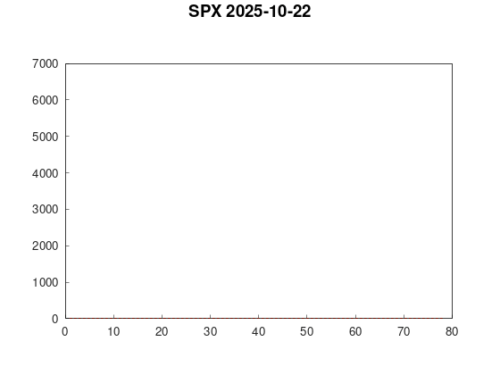

Application that fetches and aggregates historical and realtime (depending on subscription level with Polygon/Massive) SPX option data to visualise where the majority of positioning is with 0DTE contracts. The average strike for each contract weighted by volume is calculated for each 5-minute timestamp and plotted on a graph using Matplot++.

